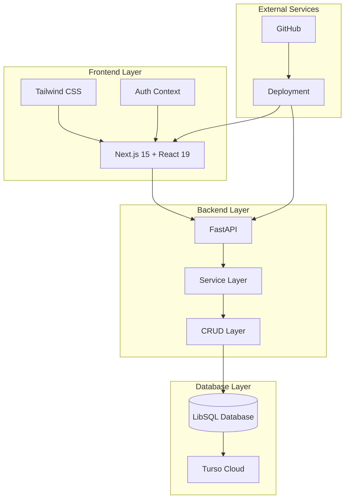

# 🏛️ ITTLC (교회 관리 시스템)

[](https://fastapi.tiangolo.com/)
[](https://nextjs.org/)
[](https://www.typescriptlang.org/)
[](https://python.org/)
[](https://turso.tech/)

> 🙏 **교회 공동체를 위한 통합 관리 시스템**  
> 성도 관리, 기도 요청, 헌금 관리, 가족 관리를 하나의 플랫폼에서 효율적으로 관리할 수 있는 현대적인 웹 애플리케이션입니다.

## 📋 목차
- [🏛️ 프로젝트 소개](#️-프로젝트-소개)
- [✨ 주요 기능](#-주요-기능)
- [🏗️ 시스템 아키텍처](#️-시스템-아키텍처)
- [📁 프로젝트 구조](#-프로젝트-구조)
- [🚀 빠른 시작](#-빠른-시작)
- [🔧 개발 환경 설정](#-개발-환경-설정)
- [📚 API 문서](#-api-문서)
- [🗄️ 데이터베이스](#️-데이터베이스)
- [🔐 보안 및 권한](#-보안-및-권한)
- [📈 개발 로드맵](#-개발-로드맵)
- [🤝 기여하기](#-기여하기)
- [📄 라이선스](#-라이선스)

---

## 🏛️ 프로젝트 소개

**ITTLC**는 교회 공동체의 디지털 전환을 위한 종합 관리 시스템입니다. 성도들의 정보 관리부터 기도 요청, 헌금 관리, 가족 관계 추적까지 교회 운영에 필요한 모든 기능을 통합적으로 제공합니다.

### 🎯 프로젝트 목표
- 📊 **효율적인 성도 관리**: 체계적인 회원 정보 관리 및 통계
- 🙏 **기도 공동체 구축**: 기도 요청 공유 및 응답 관리
- 💰 **투명한 헌금 관리**: 헌금 입력, 조회, 통계 기능
- 👨‍👩‍👧‍👦 **가족 관계 관리**: 가족 단위 관리 및 연결
- 📱 **모바일 최적화**: 언제 어디서나 접근 가능한 반응형 디자인

---

## ✨ 주요 기능

### 📊 대시보드
- 실시간 통계 및 주요 지표
- 최근 활동 타임라인
- 빠른 액션 버튼
- 공지사항 및 알림 관리

### 👥 성도 관리
- **성도 조회**: 고급 검색 및 필터링
- **성도 등록**: 상세 정보 입력 및 프로필 관리
- **정보 수정**: 개인정보 업데이트 및 이력 관리
- **통계 및 리포트**: 연령별, 지역별 통계

### 🙏 기도 관리
- **기도 제목 등록**: 카테고리별 기도 요청 관리
- **기도 참여**: 공동체 기도 참여 및 댓글
- **기도 응답**: 응답된 기도 관리 및 간증
- **기도 달력**: 특별 기도 일정 관리

### 💰 헌금 관리
- **헌금 입력**: 다양한 헌금 종류별 입력
- **헌금 조회**: 기간별, 종류별 조회
- **통계 및 리포트**: 월별, 연도별 통계
- **헌금 유형 관리**: 십일조, 감사헌금, 특별헌금 등

### 👨‍👩‍👧‍👦 가족 관리
- **가족 단위 관리**: 가족 구성원 연결 관리
- **관계 설정**: 부모-자녀, 배우자 관계 설정
- **가족 통계**: 가족 단위 통계 및 현황

### 🔧 시스템 관리
- **사용자 권한 관리**: 역할 기반 접근 제어
- **시스템 설정**: 애플리케이션 설정 관리
- **로그 관리**: 시스템 활동 로그 추적
- **데이터 백업**: 자동 백업 및 복구

---

## 🏗️ 시스템 아키텍처



### 🧩 기술 스택

#### Frontend (ittlc_fe)
- **Framework**: Next.js 15 (App Router)
- **UI Library**: React 19
- **Styling**: Tailwind CSS
- **Language**: TypeScript
- **State Management**: React Context API
- **Authentication**: Custom Auth Provider

#### Backend (ittlc_be)
- **Framework**: FastAPI
- **Language**: Python 3.9+
- **Database**: LibSQL (Turso)
- **ORM**: Custom SQL Client
- **API Documentation**: OpenAPI/Swagger
- **Authentication**: JWT Token

#### Database
- **Primary DB**: LibSQL (Turso Cloud)
- **Architecture**: Serverless SQLite
- **Features**: Real-time sync, Global replication

---

## 📁 프로젝트 구조

```
ITTLC/
├── 📚 docs/                          # 📖 프로젝트 문서
│   ├── README.md                     # 문서 개요
│   ├── development-roadmap.md        # 개발 로드맵
│   ├── phase2-api-development-complete.md  # Phase 2 완료 보고서
│   └── *-requirements.md            # 기능별 요구사항 정의서
│
├── 🐍 ittlc_be/                     # 백엔드 (FastAPI)
│   ├── app/
│   │   ├── api/v1/                  # API 엔드포인트
│   │   │   ├── endpoints/
│   │   │   │   ├── auth.py         # 인증 API
│   │   │   │   ├── members.py      # 성도 관리 API
│   │   │   │   ├── prayers.py      # 기도 관리 API
│   │   │   │   ├── offerings.py    # 헌금 관리 API
│   │   │   │   ├── families.py     # 가족 관리 API
│   │   │   │   └── system.py       # 시스템 관리 API
│   │   │   └── api.py              # API 라우터 등록
│   │   ├── core/                   # 핵심 설정
│   │   ├── db/                     # 데이터베이스 연결
│   │   ├── schemas/                # Pydantic 스키마
│   │   ├── services/               # 비즈니스 로직
│   │   └── main.py                 # 애플리케이션 엔트리포인트
│   ├── database_schema.sql         # 데이터베이스 스키마
│   ├── full_migration.py           # 마이그레이션 스크립트
│   ├── seed_data.py                # 초기 데이터 시딩
│   └── requirements.txt            # Python 의존성
│
├── ⚛️ ittlc_fe/                     # 프론트엔드 (Next.js)
│   ├── src/
│   │   ├── app/                    # App Router
│   │   │   ├── login/              # 로그인 페이지
│   │   │   ├── main/               # 메인 애플리케이션
│   │   │   │   ├── dashboard/      # 대시보드
│   │   │   │   └── layout.tsx      # 메인 레이아웃
│   │   │   └── layout.tsx          # 루트 레이아웃
│   │   ├── components/             # 재사용 가능한 컴포넌트
│   │   │   ├── layout/             # 레이아웃 컴포넌트
│   │   │   └── providers/          # Context Providers
│   │   ├── contexts/               # React Context
│   │   └── middleware.ts           # Next.js 미들웨어
│   ├── package.json                # Node.js 의존성
│   └── tailwind.config.js          # Tailwind CSS 설정
│
├── .gitignore                      # Git 제외 파일 설정
└── README.md                       # 프로젝트 메인 문서
```

---

## 🚀 빠른 시작

### 📋 사전 요구사항
- Node.js 18.0.0 이상
- Python 3.9 이상
- Git
- Turso CLI (선택사항)

### 🔧 설치 및 실행

#### 1️⃣ 프로젝트 클론
```bash
git clone https://github.com/hozza94/ittlc.git
cd ittlc
```

#### 2️⃣ 백엔드 설정
```bash
cd ittlc_be

# 가상환경 생성 및 활성화
python -m venv venv
source venv/bin/activate  # Windows: venv\Scripts\activate

# 의존성 설치
pip install -r requirements.txt

# 환경변수 설정
cp .env.example .env
# .env 파일을 편집하여 데이터베이스 연결 정보 입력

# 데이터베이스 마이그레이션
python full_migration.py

# 초기 데이터 시딩
python seed_data.py

# 서버 실행
uvicorn app.main:app --reload
```

#### 3️⃣ 프론트엔드 설정
```bash
cd ../ittlc_fe

# 의존성 설치
npm install
# 또는
yarn install

# 환경변수 설정
cp .env.example .env.local
# .env.local 파일을 편집하여 API 서버 URL 설정

# 개발 서버 실행
npm run dev
# 또는
yarn dev
```

#### 4️⃣ 애플리케이션 접속
- **프론트엔드**: http://localhost:3000
- **백엔드 API**: http://localhost:8000
- **API 문서**: http://localhost:8000/docs

---

## 🔧 개발 환경 설정

### 🐍 백엔드 개발 환경
```bash
cd ittlc_be

# 개발 의존성 설치
pip install -r requirements-dev.txt

# 코드 포맷팅
black .
isort .

# 린팅
flake8 .

# 테스트 실행
pytest

# 서버 실행 (개발모드)
uvicorn app.main:app --reload --host 0.0.0.0 --port 8000
```

### ⚛️ 프론트엔드 개발 환경
```bash
cd ittlc_fe

# 개발 서버 실행
npm run dev

# 타입 체크
npm run type-check

# 린팅
npm run lint

# 코드 포맷팅
npm run format

# 빌드
npm run build

# 프로덕션 실행
npm run start
```

---

## 📚 API 문서

### 🔗 API 엔드포인트 개요

#### 🔐 인증 API (`/api/v1/auth`)
- `POST /login` - 로그인
- `POST /logout` - 로그아웃
- `POST /refresh` - 토큰 갱신
- `GET /me` - 사용자 정보 조회

#### 👥 성도 관리 API (`/api/v1/members`)
- `GET /members` - 성도 목록 조회
- `POST /members` - 성도 등록
- `GET /members/{id}` - 성도 상세 조회
- `PUT /members/{id}` - 성도 정보 수정
- `DELETE /members/{id}` - 성도 삭제

#### 🙏 기도 관리 API (`/api/v1/prayers`)
- `GET /prayers` - 기도 목록 조회
- `POST /prayers` - 기도 등록
- `GET /prayers/{id}` - 기도 상세 조회
- `POST /prayers/{id}/participate` - 기도 참여
- `POST /prayers/{id}/comments` - 기도 댓글 작성

#### 💰 헌금 관리 API (`/api/v1/offerings`)
- `GET /offerings` - 헌금 목록 조회
- `POST /offerings` - 헌금 등록
- `GET /offerings/statistics` - 헌금 통계
- `GET /offering-types` - 헌금 종류 조회

#### 👨‍👩‍👧‍👦 가족 관리 API (`/api/v1/families`)
- `GET /families` - 가족 목록 조회
- `POST /families` - 가족 등록
- `POST /families/{id}/members` - 가족 구성원 추가
- `DELETE /families/{id}/members/{member_id}` - 가족 구성원 제거

#### 📊 시스템 관리 API (`/api/v1/system`)
- `GET /dashboard` - 대시보드 통계
- `GET /settings` - 시스템 설정 조회
- `PUT /settings` - 시스템 설정 수정
- `GET /logs` - 시스템 로그 조회

### 📖 상세 API 문서
서버 실행 후 http://localhost:8000/docs 에서 상세한 API 문서를 확인할 수 있습니다.

---

## 🗄️ 데이터베이스

### 📊 ERD (Entity Relationship Diagram)
주요 테이블 관계:
- `users` ↔ `members` (1:1)
- `families` ↔ `members` (1:N)
- `prayers` ↔ `prayer_participants` (1:N)
- `members` ↔ `offerings` (1:N)

### 🏗️ 주요 테이블 구조

#### 👥 Members (성도)
```sql
CREATE TABLE members (
    id INTEGER PRIMARY KEY AUTOINCREMENT,
    user_id INTEGER REFERENCES users(id),
    family_id INTEGER REFERENCES families(id),
    name VARCHAR(100) NOT NULL,
    phone VARCHAR(20),
    email VARCHAR(100),
    birth_date DATE,
    address TEXT,
    join_date DATE,
    status VARCHAR(20) DEFAULT 'active',
    created_at TIMESTAMP DEFAULT CURRENT_TIMESTAMP
);
```

#### 🙏 Prayers (기도)
```sql
CREATE TABLE prayers (
    id INTEGER PRIMARY KEY AUTOINCREMENT,
    member_id INTEGER REFERENCES members(id),
    category_id INTEGER REFERENCES prayer_categories(id),
    title VARCHAR(200) NOT NULL,
    content TEXT,
    is_private BOOLEAN DEFAULT FALSE,
    is_answered BOOLEAN DEFAULT FALSE,
    created_at TIMESTAMP DEFAULT CURRENT_TIMESTAMP
);
```

#### 💰 Offerings (헌금)
```sql
CREATE TABLE offerings (
    id INTEGER PRIMARY KEY AUTOINCREMENT,
    member_id INTEGER REFERENCES members(id),
    offering_type_id INTEGER REFERENCES offering_types(id),
    amount DECIMAL(10,2) NOT NULL,
    offering_date DATE NOT NULL,
    description TEXT,
    created_at TIMESTAMP DEFAULT CURRENT_TIMESTAMP
);
```

### 🔄 마이그레이션
```bash
# 마이그레이션 실행
python full_migration.py

# 초기 데이터 시딩
python seed_data.py

# 데이터베이스 연결 테스트
python quick_test.py
```

---

## 🔐 보안 및 권한

### 🛡️ 인증 시스템
- **JWT 토큰 기반 인증**
- **Role-Based Access Control (RBAC)**
- **세션 관리 및 자동 갱신**

### 👑 사용자 권한
- **Super Admin**: 전체 시스템 관리
- **Admin**: 교회 관리자 권한
- **Staff**: 일반 스태프 권한
- **Member**: 기본 사용자 권한

### 🔒 보안 기능
- 패스워드 해싱 (bcrypt)
- CORS 정책 설정
- 입력 데이터 검증
- SQL 인젝션 방지
- XSS 방지

---

## 📈 개발 로드맵

### ✅ Phase 1 - 기반 구조 (완료)
- [x] 프로젝트 초기 설정
- [x] 데이터베이스 설계 및 마이그레이션
- [x] 기본 인증 시스템
- [x] 프론트엔드 기본 레이아웃

### ✅ Phase 2 - 핵심 기능 (완료)
- [x] API 엔드포인트 개발
- [x] Pydantic 스키마 모델
- [x] 서비스 레이어 구현
- [x] 기본 CRUD 기능

### 🔄 Phase 3 - 사용자 인터페이스 (진행 중)
- [ ] 대시보드 구현
- [ ] 성도 관리 페이지
- [ ] 기도 관리 페이지
- [ ] 헌금 관리 페이지
- [ ] 가족 관리 페이지

### 🔮 Phase 4 - 고급 기능 (예정)
- [ ] 실시간 알림 시스템
- [ ] 데이터 분석 및 리포트
- [ ] 모바일 앱 개발
- [ ] 다국어 지원
- [ ] 오프라인 동기화

자세한 로드맵은 [development-roadmap.md](docs/development-roadmap.md)를 참고하세요.

---

## 🤝 기여하기

### 📝 기여 가이드라인
1. **이슈 생성**: 버그 리포트 또는 기능 요청
2. **브랜치 생성**: `feature/기능명` 또는 `bugfix/버그명`
3. **코드 작성**: 코딩 스타일 가이드 준수
4. **테스트 작성**: 새로운 기능에 대한 테스트 추가
5. **Pull Request**: 명확한 설명과 함께 PR 생성

### 🎯 코딩 스타일
- **Python**: PEP 8 준수, Black 포맷터 사용
- **TypeScript**: Prettier + ESLint 사용
- **커밋 메시지**: Conventional Commits 형식

### 🧪 테스트
```bash
# 백엔드 테스트
cd ittlc_be
pytest

# 프론트엔드 테스트
cd ittlc_fe
npm run test
```

---

## 📄 라이선스

이 프로젝트는 MIT 라이선스 하에 배포됩니다. 자세한 내용은 [LICENSE](LICENSE) 파일을 참고하세요.

---

## 📞 연락처

### 👥 개발팀
- **프로젝트 관리자**: [GitHub](https://github.com/hozza94)
- **이슈 제기**: [Issues](https://github.com/hozza94/ittlc/issues)
- **토론**: [Discussions](https://github.com/hozza94/ittlc/discussions)

### 📧 지원
- **기술 지원**: 기술적 문제나 질문
- **기능 요청**: 새로운 기능 제안
- **버그 리포트**: 발견된 버그 신고

---

## 🙏 감사의 말

이 프로젝트는 교회 공동체의 디지털 전환을 위한 열정으로 시작되었습니다. 모든 기여자들과 사용자들께 감사드립니다.

> **"두 사람이 하나보다 낫다. 그들의 수고가 좋은 상을 얻을 것이기 때문이다."**  
> *전도서 4:9*

---

<div align="center">
  <strong>🏛️ ITTLC - 교회 공동체를 위한 디지털 플랫폼 🙏</strong>
</div> 